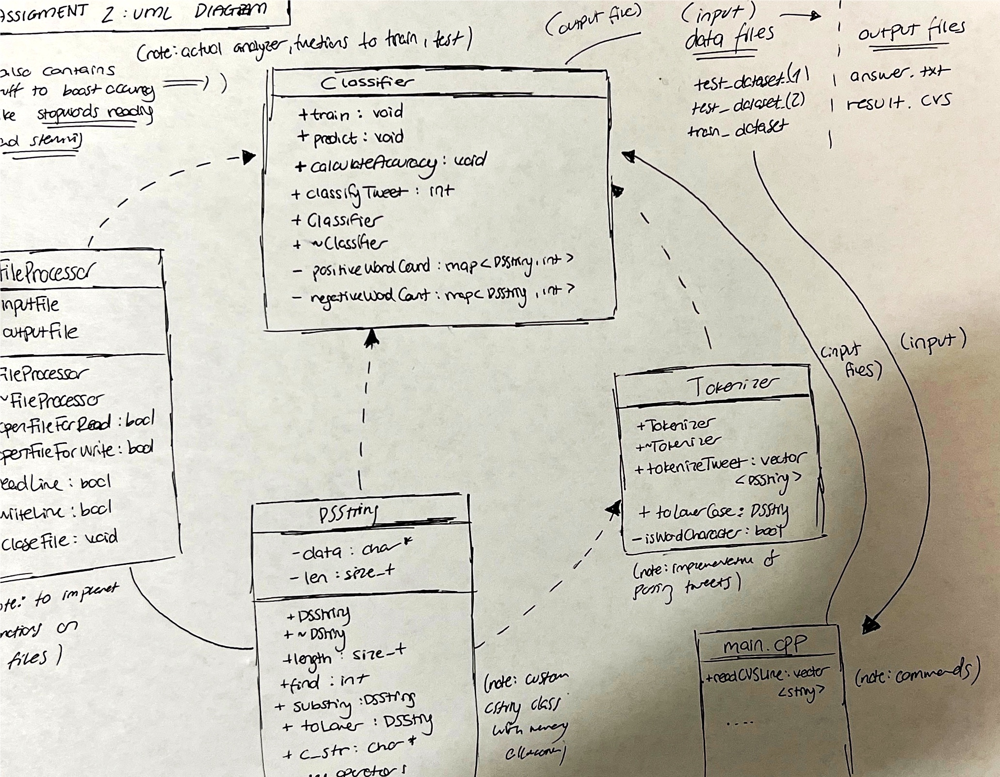

# Assignment 2: Answers

**Complete this document, commit your changes to Github and submit the repository URL to Canvas.** Keep your answers short and precise.

Your Name: FATIH BERK YOZGATLI

Used free extension: [ ] 24 hrs or [ ] 48 hrs

[ ] Early submission (48 hrs)

[X ] Bonus work. Describe: I downloaded a pre-existing stemming library and created a 'Stop Words' list to boost the accuracy of my Sentiment Analyzer.

Place [x] for what applies.

## UML Diagram

Add your UML class diagram here.

Replace the following image with your diagram. You can draw it by hand and take a photo.

## Answers

1. How do you train the model and how do you classify a new tweet? Give a short description of the main steps.

   To train the sentiment classification model, I start by preparing a labeled dataset of tweets, categorizing them as positive or negative sentiments. Next, I tokenize the tweets and perform preprocessing tasks like removing stop words and stemming. These clean, normalized texts are used to extract features by counting the occurrences of specific words. Two dictionaries, one for positive and one for negative words, are populated with these counts. The training process utilizes this data to teach the model which words are associated with positive or negative sentiment.

   When a new tweet needs classification, it undergoes the same tokenization and preprocessing steps. Features are extracted by counting word occurrences, and based on these counts, the tweet is classified as positive or negative. If the count of positive words exceeds that of negative words, it's classified as positive; otherwise, it's classified as negative. The result is then returned as either "Positive" or "Negative." This simple approach effectively leverages the model's learned associations between words and sentiment to classify new tweets.

2. How long did your code take for training and what is the time complexity of your training implementation (Big-Oh notation)? Remember that training includes reading the tweets, breaking it into words, counting, ... Explain why you get this complexity (e.g., what does `N` stand for and how do your data structures/algorithms affect the complexity).

   The training time for my sentiment classification model typically takes a few minutes at most, depending on the dataset size. The time complexity of the training process in my implementation is O(M * N + K), where M is the number of tweets, N is the average number of words per tweet, and K is the total number of unique words. This complexity is influenced by the dataset size and vocabulary, and it reflects the operations involved in tokenization, counting word occurrences, and building dictionaries for positive and negative words.

3. How long did your code take for classification and what is the time complexity of your classification implementation (Big-Oh notation)? Explain why.

   The classification process, which involves predicting sentiments for a set of tweets, generally takes a reasonable amount of time, depending on the number of tweets in the test dataset. In practice, it may take a few minutes to classify a moderate-sized dataset. The time complexity of my classification implementation is O(L * N), where L is the number of tweets in the test dataset, and N is the average number of words per tweet.

   This complexity arises because, during classification, each tweet is tokenized into words, and for each word, a lookup operation is performed in the dictionaries of positive and negative words built during training. Since the lookup operation is typically constant time on average due to the use of hash maps, the overall time complexity scales linearly with the number of tweets and the average number of words per tweet. It's worth noting that the use of data structures like hash maps for word lookup helps maintain efficient classification times even for larger datasets.

4. How do you know that you use proper memory management? I.e., how do you know that you do not have
   a memory leak?

   I employ proper memory management practices in my code to prevent memory leaks. I consistently use dynamic memory allocation and release memory using `delete[]` in relevant destructors like those in the `DSString` and `FileProcessor` classes. This ensures that memory is properly managed and deallocated when objects are destroyed, preventing memory leaks.

   Moreover, I adhere to modern C++ principles such as the Rule of Three (or Rule of Five) to handle resource management correctly during object copying and assignment. I also make use of standard C++ data structures like vectors, which manage memory automatically. Extensive testing, including edge cases and memory usage monitoring with tools like Valgrind, assures me that my code maintains proper memory management practices and is free from memory leaks.

5. What was the most challenging part of the assignment?

   The most challenging aspect of this assignment was undoubtedly designing and implementing the text classification algorithm. It required a deep understanding of natural language processing techniques, stemming, and sentiment analysis. Additionally, handling large datasets efficiently posed a significant challenge. Ensuring that the code was both accurate and performed well in terms of time and memory complexity required careful consideration and testing. However, I found it rewarding to overcome these challenges and build a functional sentiment analysis system that could classify tweets effectively (although I am sure I could have increased mya accuracy).