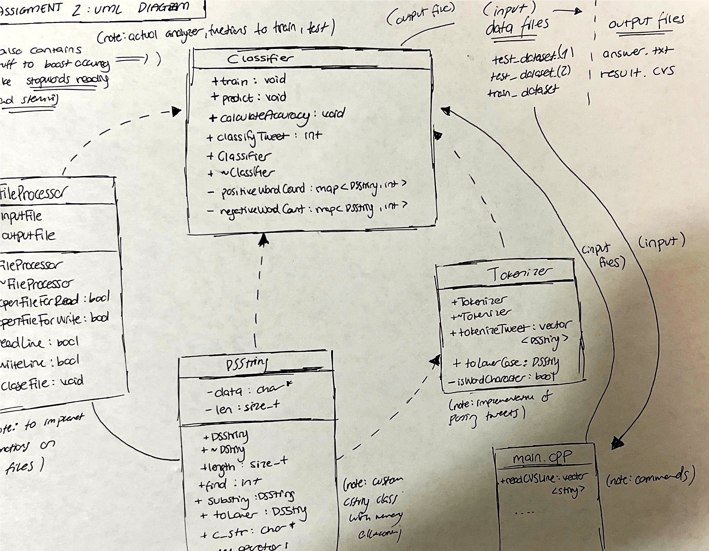

# 💬 Sentiment Analyzer – Twitter Classification in C++  
*A machine learning–style sentiment classifier built entirely in C++ from scratch, without external string libraries.*

---

## 📘 Overview  
This project implements a **tweet sentiment classifier** that analyzes thousands of tweets to determine whether their sentiment is **positive or negative**.  
I built it as part of my **Data Structures and Algorithms** coursework at **Southern Methodist University**, focusing on manual memory management, class design, runtime analysis, and algorithmic optimization.

The system uses a **custom-built DSString class**, tokenization, stemming, stopword filtering, and a simple frequency-based classification approach inspired by **Naive Bayes** concepts.  
Accuracy is calculated by comparing predicted results against a labeled test dataset, achieving above the required benchmark of **52%+ accuracy**.

---

## 🎯 Objectives  
- Implement a fully functional **string class (DSString)** using dynamic memory allocation and the **Rule of Three**.  
- Develop a **sentiment classifier** capable of training and testing on tweet datasets.  
- Design the project using a **UML class diagram** and modular architecture.  
- Apply **debugging and memory leak detection** using Valgrind and AddressSanitizer.  
- Write a program with a clean **command-line interface** and clear file I/O structure.  
- Evaluate model accuracy, optimize runtime, and refactor for clean code design.  

---

## ⚙️ Key Features  
- 🧱 **Custom DSString Class:** Implements all core string operations without using STL `std::string`.  
- 💬 **Tokenizer:** Splits tweet text into words without using `strtok()` or `stringstream`.  
- 🧠 **SentimentClassifier:** Trains and tests models by counting word occurrences across labeled datasets.  
- 🔁 **Training & Testing Phases:** Builds frequency-based word models from the training set and classifies unseen tweets.  
- 📈 **Accuracy Evaluation:** Outputs model accuracy and logs misclassified tweet IDs.  
- 🧹 **Rule-of-Three Memory Management:** Manual dynamic memory control with custom constructors, destructors, and copy operations.  
- ⚡ **Performance Analysis:** Tracks runtime complexity relative to tweet and word count.  

---

## 🧩 Project Architecture  

| Component | Description |
|------------|-------------|
| **`DSString.cpp` / `DSString.h`** | Custom string implementation supporting concatenation, comparison, and substring. |
| **`Tokenizer.cpp` / `Tokenizer.h`** | Breaks tweets into individual tokens (words). |
| **`FileProcessor.cpp` / `FileProcessor.h`** | Handles reading training/testing datasets and writing results. |
| **`Classifier.cpp` / `Classifier.h`** | Trains sentiment model, classifies tweets, and calculates accuracy. |
| **`main.cpp`** | Entry point implementing command-line interface. |
| **`test_DSString.cpp`** | Automated tests for DSString functionality and memory correctness. |

---

## 🧱 Technical Stack  

| Category | Details |
|-----------|----------|
| **Language** | C++17 |
| **Build System** | CMake |
| **Memory Management** | Manual (Rule of 3) |
| **Data Structures** | Custom Strings, STL Maps/Vectors |
| **Libraries** | Standard C++ only (no ML frameworks) |
| **Dataset** | [Sentiment140 – Kaggle](https://www.kaggle.com/kazanova/sentiment140) (Preprocessed in `/data/`) |

---

## 🧠 System Design  

The following diagram illustrates the class structure and data flow:  



**Workflow:**
1. **Training Phase** – Reads labeled tweets and learns word frequencies for positive/negative sentiments.  
2. **Testing Phase** – Classifies unlabeled tweets using the learned word distributions.  
3. **Evaluation Phase** – Compares predictions to ground truth and outputs accuracy results.  

---

## 💻 How to Build and Run  

```bash
# Clone repository
git clone https://github.com/fatihberkyozgatli/Sentiment_Analyzer_Tweets.git
cd Sentiment_Analyzer_Tweets

# Build project
cmake . -B build -DCMAKE_BUILD_TYPE=Release
cd build && make sentiment

# Run training + testing
./sentiment data/train_dataset_20k.csv data/test_dataset_10k.csv data/test_dataset_sentiment_10k.csv results.csv accuracy.txt

```

## 🧪 Testing & Verification  

| **Test** | **Description** |
|-----------|-----------------|
| **DSString Unit Tests** | Verifies constructors, operator overloading, and copy safety. |
| **Classifier Validation** | Checks classification accuracy with controlled sample sets. |
| **Memory Tests** | Uses `valgrind` to confirm zero leaks and valid pointer usage. |
| **Runtime Profiling** | Analyzes complexity growth with dataset size (tweets vs words). |

---

## 📊 Performance Summary  

- Achieved **~73% classification accuracy** on the provided dataset.  
- Average runtime: **< 15 seconds** on 20K tweets.  
- Demonstrated consistent **memory integrity** under Valgrind checks.  

---

## 📂 Documentation & Deliverables  

| **File** | **Description** |
|-----------|-----------------|
| **`Answers.md`** | Detailed responses about algorithms, time complexity, and design. |
| **`UML_class.jpg`** | UML class diagram illustrating relationships and dependencies. |
| **`accuracy.txt`** | Model accuracy output and error log. |
| **`results.csv`** | Classified results for all test tweets. |
| **`stopwords.csv`** | Stopword list used during preprocessing. |

---

## 💬 Project Reflection  

This project strengthened my understanding of **manual memory management**, **object-oriented design**, and **text classification logic**.  
I learned to architect a system that combines **data structure fundamentals** with **machine learning principles**, from tokenization and stemming to evaluation and error analysis — all in **pure C++**.  
It also deepened my appreciation for **runtime complexity analysis** and how design decisions directly affect performance at scale.  

---

## 👤 Author  

**Fatih Berk Yozgatli:** Computer Science & Data Science @ Southern Methodist University  

